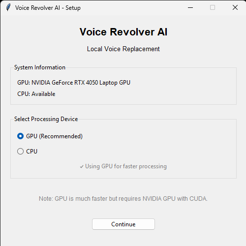
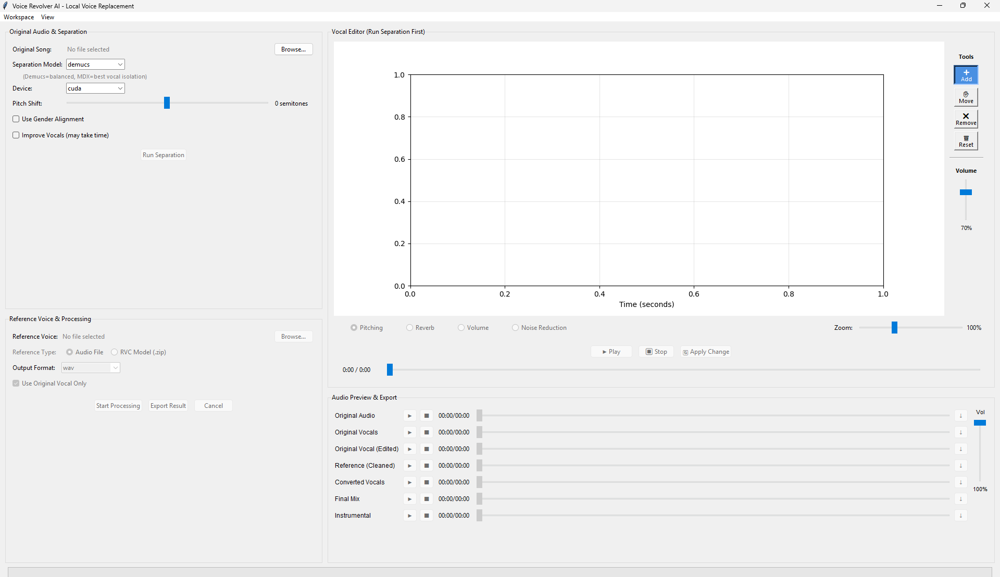
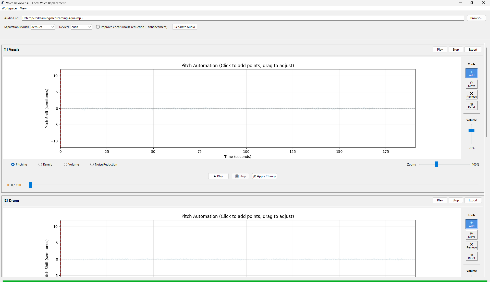
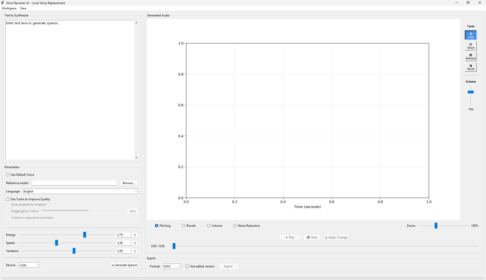
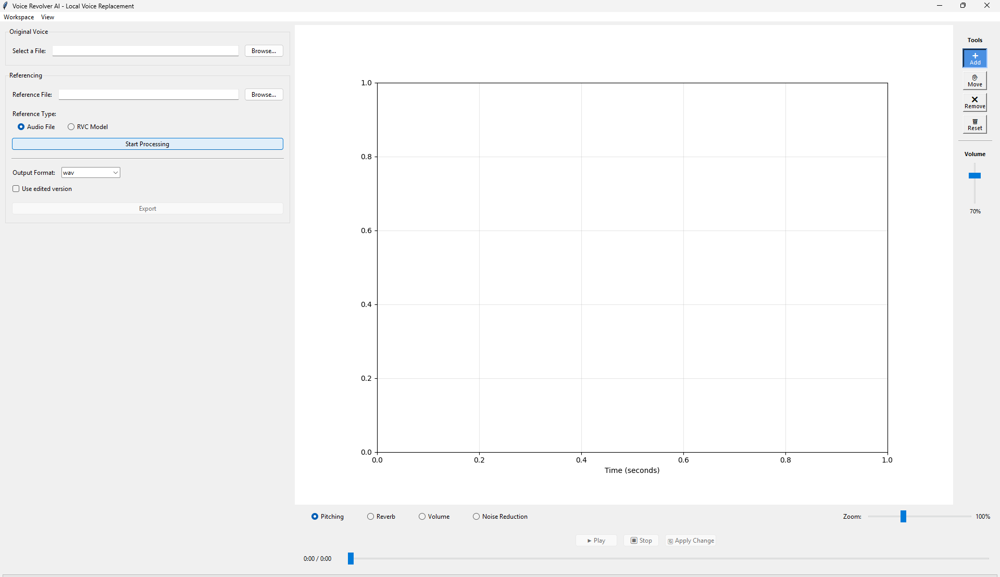
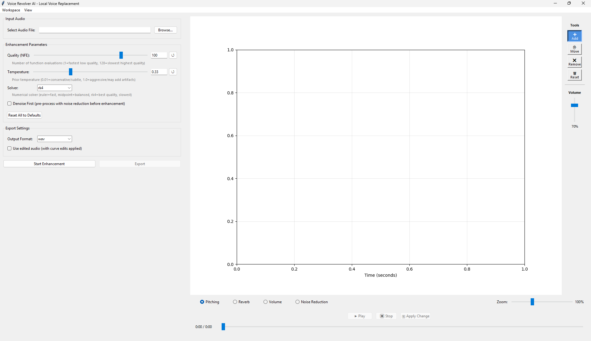
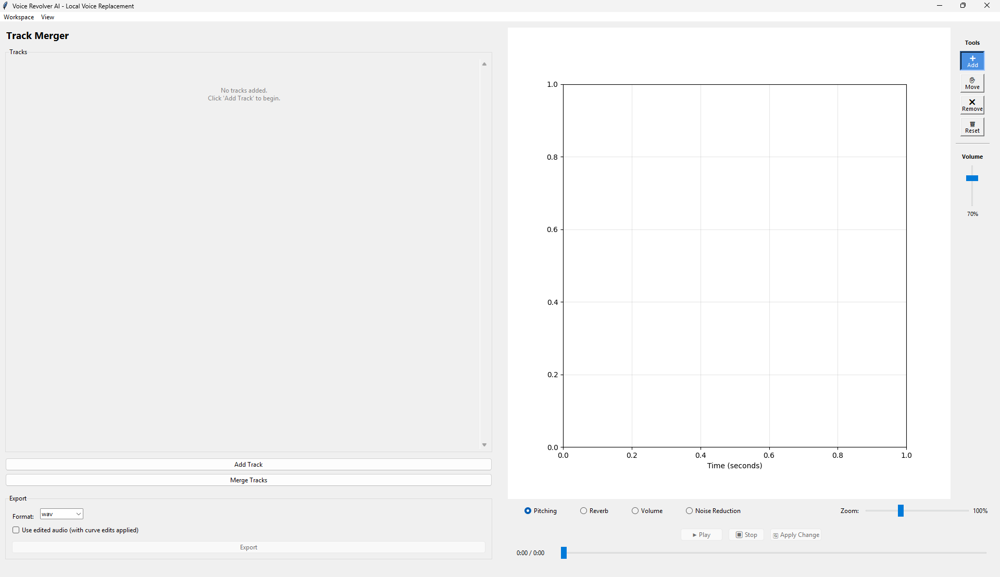
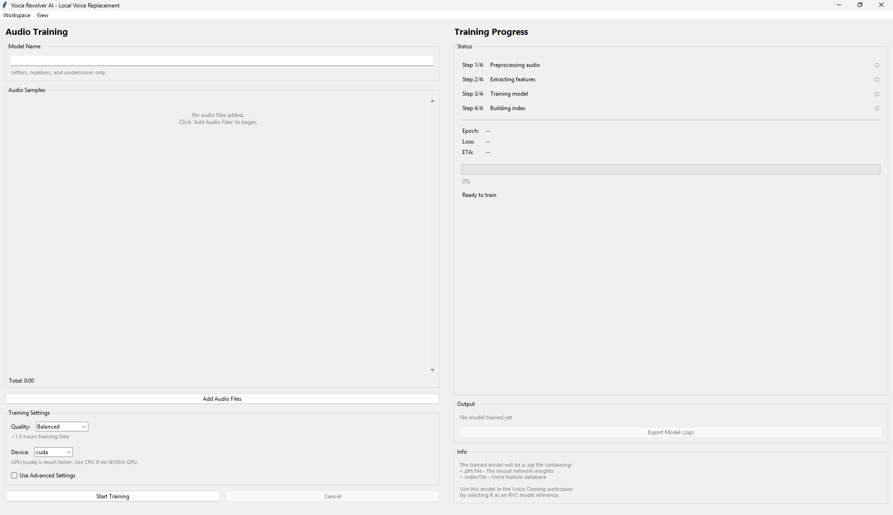

# Voice Revolver AI

<div align="center">
  
  <br>
  <em>A comprehensive, locally-run AI audio workstation with 7 specialized tools.</em>
</div>

> **AI-Powered Audio Workstation** for voice cloning, vocal replacement, stem separation, and custom voice model training - 100% local, no cloud required.

[](https://opensource.org/licenses/MIT)
[](https://www.python.org/downloads/)
[](https://github.com/JeroTan/voice-revolver-local-ai)

**Transform any voice into another** using state-of-the-art AI models, separate audio stems, enhance vocal quality, and train custom voice models - all running locally on your computer.

---

## 📋 Table of Contents

- [What is Voice Revolver AI?](#what-is-voice-revolver-ai)
- [Key Features](#key-features)
- [7 Specialized Workspaces](#7-specialized-workspaces)
- [Installation](#installation)
  - [Method 1: Download Installer](#method-1-download-installer-coming-soon)
  - [Method 2: Build Installer Yourself](#method-2-build-installer-yourself)
  - [Current Stable Developer Run](#current-stable-developer-run)
  - [Portable Installer Details](#portable-installer-details)
  - [Headless Bootstrap Tests](#headless-bootstrap-tests)
  - [Dependency Lock Files](#dependency-lock-files)
  - [For Developers](#for-developers)
- [Quick Start Guide](#quick-start-guide)
- [System Requirements](#system-requirements)
- [GPU Acceleration](#gpu-acceleration-optional)
- [Documentation](#documentation)
- [Troubleshooting](#troubleshooting)
- [Contributing](#contributing)
- [License](#license)

---

## 🎯 What is Voice Revolver AI?

Voice Revolver AI is a **comprehensive audio workstation** that uses deep learning to:

- **Replace vocals** in songs with your own voice or any reference voice
- **Clone voices** from audio samples or pre-trained RVC models
- **Separate audio** into individual stems (vocals, drums, bass, instrumental)
- **Enhance audio quality** with AI-powered denoising and effects
- **Train custom voice models** for personalized voice conversion
- **Generate speech** from text with voice cloning (23 languages supported)
- **Merge multiple audio tracks** with professional mixing controls

All processing happens **100% locally** on your computer - no cloud uploads, no API keys required (except optional HuggingFace for advanced TTS).

---

## ✨ Key Features

###  Professional Quality
- **State-of-the-art AI models**: ChatterBox VC, RVC/Applio, Demucs, MDX23C, Resemble Enhance
- **GPU acceleration** - 10-20x faster processing with NVIDIA GPUs
- **Lossless export** - WAV, FLAC support plus MP3, OGG for compression

### 🎨 User-Friendly Interface
- **7 specialized workspaces** for different audio tasks
- **Interactive waveform editor** with visual curve editing
- **Real-time audio preview** - Hear changes before exporting
- **Drag-and-drop** file management (coming soon in v1.3)

### 🛠️ Advanced Controls
- **Fine-tune everything**: pitch, reverb, volume, blend curves
- **RVC model training** - Create your own voice models
- **Batch processing** ready (developer API available)
- **Project files (.vra)** - Save and resume work anytime

---

## 🎛️ 7 Specialized Workspaces

### 1. 🎤 **Vocal Changer** - Replace Vocals in Songs



Transform existing songs by replacing the original vocals with any reference voice.

**Use Cases:**
- Upload your voice and hear yourself sing your favorite songs
- Change gender/accent of vocals
- Restore old recordings with modern voices
- Create personalized voice content

**Features:**
- Dual AI engines: ChatterBox VC (easy) + RVC models (professional)
- Automatic stem separation (Demucs/MDX)
- 5-curve editing: vocal volume, pitch, reverb, blend, instrumental volume
- Gender-aware pitch adaptation
- 6-track preview player

---

### 2. 🎵 **Audio Separation** - Extract Individual Stems



Isolate vocals, drums, bass, and other instruments from any song.

**Use Cases:**
- Create karaoke tracks (extract instrumental)
- Sample individual instruments for remixes
- Remove vocals for background music
- Analyze musical arrangements

**Features:**
- Demucs (4-stem: vocals, drums, bass, other)
- MDX23C (2-stem: vocals, instrumental - faster)
- Per-stem pitch/volume/reverb editing
- Individual export with format conversion
- Waveform visualization

---

### 3. 🗣️ **Text to Speech** - Generate Speech with Voice Cloning



Convert text to natural-sounding speech using AI voice models.

**Use Cases:**
- Audiobook narration
- Voiceovers for videos
- Accessibility (text-to-audio conversion)
- Language learning (pronunciation examples)

**Features:**
- 23 languages supported (MTL engine)
- English high-quality mode (Turbo engine)
- Special tokens: [laugh], [sigh], [pause]
- Voice cloning from audio samples
- Pitch/reverb/volume curve editing

---

### 4. 🎭 **Voice Cloning** - Clone Any Voice



Clone voices using either simple audio samples or professional RVC models.

**Use Cases:**
- Character voices for animations/games
- Personalized virtual assistants
- Voice impersonation for creative projects
- Voice preservation (save loved ones' voices)

**Features:**
- **Audio File mode**: Upload 30-60 seconds of voice → instant cloning (ChatterBox)
- **RVC Model mode**: Use professionally trained models (.zip files)
- 6 RVC parameters: pitch shift, index rate, protection, filter radius, RMS mix, F0 method
- Non-destructive editing (always keep original)
- Export comparison (edited vs original)

---

### 5. ✨ **Voice Enhancement** - AI Audio Quality Improvement



Enhance audio quality with AI-powered denoising and professional effects.

**Use Cases:**
- Clean up podcast recordings
- Remove background noise from vocals
- Improve phone call recordings
- Restore old/damaged audio

**Features:**
- Resemble Enhance AI (denoise + enhance in one step)
- Blend mode: A/B comparison original vs enhanced
- Pedalboard effects: Reverb, Compressor, Limiter, Gain, Chorus, Phaser, Delay
- 8 effect presets: Studio Vocal, Warm & Rich, Bright & Clear, Radio, etc.
- Curve editing: blend → pitch → volume → reverb

---

### 6. 🎚️ **Track Merger** - Merge Multiple Audio Files



Combine unlimited audio tracks into a single mixed output.

**Use Cases:**
- Podcast editing (merge intro + content + outro)
- Music mashups (combine multiple songs)
- Layered sound design
- Audio collage creation

**Features:**
- Up to 999 tracks supported
- Per-track volume control (0-200%)
- Per-track playback with seek slider
- Waveform visualization for each track
- Auto-normalize prevents clipping
- Curve editing on merged output

---

### 7. 🎓 **Audio Training** - Train Custom RVC Voice Models



Train your own RVC voice models from audio samples for highest-quality voice cloning.

**Use Cases:**
- Create professional character voices
- Build custom voice datasets
- Voice preservation projects
- Commercial voice model development

**Features:**
- 4-step pipeline: preprocess → extract → train → index
- Windows single-GPU compatible (RTX 4050 tested)
- Training time: ~2 hours for 200 epochs (17s audio sample)
- Real-time training logs and progress
- Export as .zip for Voice Cloning workspace
- Recommended: 1-5 minutes audio, 200-500 epochs

---

## 📥 Installation

There are two installation paths:

- **Method 1:** download the ready-made installer.
- **Method 2:** build the installer yourself from this repository.

### Method 1: Download Installer (Coming Soon)

Download link: **Coming soon**

When the installer is available:

1. Download `VoiceRevolverAI-Setup.exe`.
2. Run the installer.
3. Choose where to install the program.
4. Choose where to store models/weights.
5. Choose whether to create a desktop shortcut.
6. Keep dependency and model-cache installation enabled on first install.
7. Click `Install`.
8. When setup succeeds, choose `Run the app`, `Run and close`, or `Close`.

The installed app is launched through `voice-revolver.exe`. It opens a visible console beside the UI and follows the same startup workflow as `run_dev.bat`.

### Method 2: Build Installer Yourself

Use this when you want to create the installer locally.

Requirements:
- Windows
- Python 3.11
- working project checkout with the repo virtual environments available
- local RVC asset files under `rvc/models/` if you want setup to bundle RVC predictors/embedders/pretrained weights
- enough disk space for build artifacts, dependency caches, model weights, and PyInstaller output

Build command:

```powershell
.\venv\Scripts\python.exe tools\build_installer.py
```

Build outputs:
- `dist/VoiceRevolverAI-Setup.exe` - distributable installer
- `dist/VoiceRevolverAI-Setup-v1.0.0.exe` - versioned copy
- `dist/voice-revolver.exe` - installed-app launcher binary used by setup

Validate the built installer payload without opening the installer UI:

```powershell
$p = Start-Process -FilePath .\dist\VoiceRevolverAI-Setup.exe -ArgumentList '--validate-only' -Wait -PassThru
$p.ExitCode
```

Expected result: `0`

Do not distribute `dist/voice-revolver.exe` by itself. It is only the launcher copied into an installed app folder by `VoiceRevolverAI-Setup.exe`.

### Current Stable Developer Run

`run_dev.bat` is the source-of-truth stable launcher for this repository.

```powershell
.\run_dev.bat
```

It does this:
- activates repo-local `venv`
- prints Python version
- runs `.\venv\Scripts\python.exe run.py`
- opens the console, startup device dialog, loading/model dialog, then the main UI

Use `run_dev.bat` when developing or verifying regressions.

---

### Portable Installer Details

The portable installer flow now exists in repo tooling.

Build outputs:
- `dist/VoiceRevolverAI-Setup.exe`
- `dist/VoiceRevolverAI-Setup-v1.0.0.exe`
- `dist/voice-revolver.exe`

`VoiceRevolverAI-Setup.exe` is the distributable installer. It contains a runtime-only staged app payload plus the launcher binary. Installer logs may say `copy`; that means copying bundled payload files from the setup package into the selected install/model folders. The target machine should not need this development repo.

Setup payload includes only runtime essentials:
- `run.py`
- `assets/`
- `rvc/` runtime code and bundled RVC weights
- `voice_revolver_core/`
- `voice_revolver_ui/`
- exact dependency lock files
- `tools/portable_installer/` installer support code

Setup payload excludes project docs, agent memory, tasklists, tests, samples, old files, and development/build scripts.

Installer behavior:
- asks where to install the program
- defaults to `%ProgramFiles%\Voice Revolver AI`
- asks where to store models/weights
- asks whether to create a desktop shortcut
- enables model-cache download during setup by default
- creates/writes portable config
- installs/copies app files
- installs `voice-revolver.exe`
- copies bundled RVC weights to the selected model folder
- can install Python 3.11 and exact dependency lock files through the bootstrap engine
- audits installed package versions against lock files before skipping existing environments
- repairs dependency drift by reinstalling the exact lock file when needed
- shows real-time stage/log/progress output
- finishes with `Run the app`, `Run and close`, and `Close`
- changes `Close` to `Cancel` while installing; cancel stops the active command and cleans partial install artifacts where safe

Model behavior:
- ChatterBox, Demucs, Torch, HuggingFace, MDX, and related caches are redirected to the selected model folder where supported.
- Demucs `htdemucs_ft` weights are prefetched during setup when model downloads are enabled.
- RVC pretrained weights are bundled/copied into the selected model folder.
- RVC predictor/embedder assets are validated during setup and loaded from the selected model folder at runtime.
- OpenVoice V2 is legacy optional. Its upstream checkpoint URL returned 404 during 2026-06-24 testing, so setup no longer auto-downloads or requires OpenVoice.
- Installer applies a Hydra compatibility patch required by Demucs on Python 3.11; package locks alone do not preserve this local stable-env patch.
- Installer repairs `setuptools`/`PyYAML` runtime files when a recreated venv has broken package contents.
- Installer validates `soundfile` in all envs and force-reinstalls the locked wheel if `libsndfile_x64.dll` is missing or broken.

Installed app behavior:
- double-click `voice-revolver.exe`
- visible console opens
- launcher reads `config\portable.json`
- launcher sets portable env vars
- launcher runs the same app flow as `run_dev.bat`

### Headless Bootstrap Tests

Use this to test installer logic without clicking through the setup UI.

Dry-run with explicit paths:
```powershell
.\venv\Scripts\python.exe tools\portable_installer\bootstrap.py `
  --dry-run `
  --install-root F:\tmp\VoiceRevolverAI `
  --model-root F:\tmp\VoiceRevolverAI-Models `
  --no-shortcut `
  --install-dependencies `
  --download-models `
  --log-path F:\tmp\voice-revolver-bootstrap.jsonl
```

Interactive prompt mode:
```powershell
.\venv\Scripts\python.exe tools\portable_installer\bootstrap.py --dry-run --interactive
```

The interactive mode asks:
- where to install the program
- where to store models/weights
- whether to create a shortcut

Full local bootstrap simulation, same engine used by the installer UI:
```powershell
.\venv\Scripts\python.exe tools\portable_installer\bootstrap.py `
  --install-root D:\sample `
  --model-root D:\sample2 `
  --shortcut `
  --install-dependencies `
  --download-models `
  --install-scoop `
  --launcher-exe F:\dev\Python\voice-revolver-local-ai\dist\voice-revolver.exe `
  --log-path C:\Users\jerow\AppData\Local\VoiceRevolverAI\logs\codex-headless-d-sample.jsonl
```

Last verified 2026-06-25 with `D:\sample` and `D:\sample2`: all four venvs matched locks, lock drift repair corrected `numpy==2.4.6` back to locked `numpy==1.23.5`, simulated missing `libsndfile_x64.dll` repaired through locked `soundfile==0.13.1`, Demucs/Hydra validation passed, Demucs weights downloaded into `D:\sample2`, RVC loaded `rmvpe.pt` from `D:\sample2\rvc\predictors`, RVC wrapper conversion produced `converted.wav`, Resemble Enhance resolved through `D:\sample\venvs\venv-enhance`, tiny Demucs separation produced all stems, and `D:\sample\voice-revolver.exe --validate-only` returned `Validation OK`.

---

### Dependency Lock Files

The installer uses lock files generated from the working local environments:

- `requirements-main.lock.txt` from `venv`
- `requirements-rvc.lock.txt` from `venv-rvc`
- `requirements-mdx.lock.txt` from `venv-mdx`
- `requirements-enhance.lock.txt` from `venv-enhance`

Current env split:
- `venv`: main app, UI, Demucs, ChatterBox, optional legacy OpenVoice code
- `venv-rvc`: RVC inference/training
- `venv-mdx`: MDX/audio-separator
- `venv-enhance`: Resemble Enhance

Do not rely on `requirements.txt` alone for installer reproducibility.

---

### For Developers

```powershell
# Clone with full git history
git clone https://github.com/JeroTan/voice-revolver-local-ai.git
cd voice-revolver-local-ai

# Stable development run
.\run_dev.bat

# Or manually run the same target
.\venv\Scripts\python.exe run.py

# Build portable launcher + setup
.\venv\Scripts\python.exe tools\build_installer.py

# Run smoke validation
.\dist\voice-revolver.exe --validate-only
```

**Important:** `run_dev.bat` is the stable baseline. If `run_dev.bat` works but installed `voice-revolver.exe` fails, the bug is in packaging/launcher. If both fail, core app changed incorrectly.


**Project Structure:**
```
voice-revolver-local-ai/
├── voice_revolver_core/      # Domain-driven core (DDD architecture)
│   ├── domain/               # Business logic (stem separation, voice conversion)
│   ├── application/          # Use cases (voice replacement service)
│   └── infrastructure/       # External integrations (Demucs, RVC, ChatterBox)
├── voice_revolver_ui/        # User interface (tkinter)
│   ├── features/             # 7 workspaces + dialogs
│   └── components/           # Reusable UI widgets
├── rvc/                      # Applio RVC module (voice training/cloning)
├── docs/                     # Documentation
└── tests/                    # Unit/integration tests
```

See **[AGENT_MEMORY.md](AGENT_MEMORY.md)** for development history and technical lessons learned.

---

## 🚀 Quick Start Guide

### First Launch

1. **Run the application:**
   - Installed app: double-click `voice-revolver.exe`
   - Development app: double-click `run_dev.bat`
   - Manual equivalent: `.\venv\Scripts\python.exe run.py`

2. **Choose your device:**
   - **GPU (CUDA)** - For NVIDIA graphics cards (10-20x faster)
   - **CPU** - For any computer (works but slower)

3. **Wait for models to download** (first time only):
   - Models use the installer-selected model folder when running installed.
   - Development defaults to `%LOCALAPPDATA%\VoiceRevolverAI\models`.
   - First run may take several minutes depending on model cache state.

4. **Start using:**
   - Select a workspace from the menu: `Workspace → [Choose Feature]`
   - Load an audio file
   - Process and export!

### Example: Replace Vocals in a Song

1. **Launch** → Select **Vocal Changer** workspace
2. **Load Input**: Click "Browse" → Select your song (MP3/WAV/FLAC)
3. **Load Reference**: Click "Browse Reference" → Select voice sample (30-60 seconds)
4. **Configure**:
   - Separator: Demucs (balanced) or MDX (faster)
   - Reference Mode: Audio File
   - Gender Difference: Auto (or manual -12/+12 semitones)
5. **Process**: Click "Start Processing" → Wait 2-10 minutes
6. **Preview**: Play each track to hear results
7. **Export**: Choose format → Click "Export Final Mix"

### Example: Train a Custom Voice Model

1. **Launch** → Select **Audio Training** workspace
2. **Prepare Audio**: 1-5 minutes of clean voice audio (WAV/MP3)
3. **Configure**:
   - Model Name: `my_voice_model`
   - Epochs: 200-300 (more = better quality)
   - Sample Rate: 40000 Hz (balanced)
   - F0 Method: rmvpe (recommended)
4. **Start Training**: Click "Start Training" → Wait ~2 hours (RTX 4050)
5. **Export Model**: Select checkpoint → Export as .zip
6. **Use in Voice Cloning**: Load the .zip in Voice Cloning workspace!

---

## 💻 System Requirements

### Minimum (CPU Processing)
- **OS**: Windows 10/11 (64-bit)
- **CPU**: Intel Core i5 / AMD Ryzen 5 (4+ cores)
- **RAM**: 8 GB
- **Storage**: 10 GB free space for app + caches
- **Python**: 3.11.x for development; installer can bootstrap Python 3.11

**Performance**: 
- Stem separation: 2-5 minutes per song
- Voice conversion: 30-60 seconds per minute of audio
- RVC training: 8-12 hours for 200 epochs (not recommended)

### Recommended (GPU Acceleration)
- **OS**: Windows 10/11 (64-bit)
- **CPU**: Intel Core i7 / AMD Ryzen 7
- **GPU**: NVIDIA RTX 3060 / RTX 4050 or better (6GB+ VRAM)
- **RAM**: 16 GB
- **Storage**: 25 GB free space for installer, venvs, models, and temp files
- **Python**: 3.11.x for development; installer can bootstrap Python 3.11
- **CUDA**: Toolkit 11.8

**Performance**:
- Stem separation: 15-30 seconds per song (10-20x faster!)
- Voice conversion: 3-5 seconds per minute of audio
- RVC training: 2-3 hours for 200 epochs

### Supported File Formats

**Input:**
- Audio: WAV, MP3, FLAC, OGG, M4A
- RVC Models: .zip (containing .pth + .index)
- Projects: .vra (Voice Revolver AI project files)

**Output:**
- Audio: WAV (lossless), MP3 (compressed), FLAC (lossless compressed), OGG (compressed)
- RVC Models: .zip (exportable from Audio Training)

---

## ⚡ GPU Acceleration (Optional)

GPU acceleration provides **10-20x speed improvements** for all AI operations.

### Why GPU?
| Task | CPU Time | GPU Time | Speedup |
|------|----------|----------|---------|
| Demucs Separation (4min song) | 2-5 min | 15-30 sec | **10x** |
| MDX Separation (4min song) | 30 min | 2 min | **15x** |
| Voice Conversion (1min audio) | 30-60 sec | 3-5 sec | **10x** |
| RVC Training (200 epochs) | 10-15 hr | 2-3 hr | **5-7x** |

### Setup Instructions

#### 1. Install CUDA Toolkit 11.8
Download from: [NVIDIA CUDA Toolkit 11.8](https://developer.nvidia.com/cuda-11-8-0-download-archive)

- Choose: Windows → x86_64 → 10/11 → exe (local)
- Install all components (drivers, runtime, toolkit)
- Reboot after installation

#### 2. Install PyTorch with CUDA Support
```powershell
# Activate your virtual environment
.\venv\Scripts\Activate.ps1

# Uninstall CPU-only PyTorch
pip uninstall torch torchaudio -y

# Install CUDA-enabled PyTorch
pip install torch==2.1.2 torchaudio==2.1.2 --index-url https://download.pytorch.org/whl/cu118 --force-reinstall

# Install cuDNN libraries
pip install nvidia-cudnn-cu11 nvidia-cublas-cu11
```

#### 3. Verify GPU Detection
```powershell
python -c "import torch; print('CUDA available:', torch.cuda.is_available()); print('GPU:', torch.cuda.get_device_name(0) if torch.cuda.is_available() else 'None')"
```

Expected output:
```
CUDA available: True
GPU: NVIDIA GeForce RTX 4050 Laptop GPU
```

If you see `False`, check:
- CUDA Toolkit installed correctly
- NVIDIA drivers up to date
- cuDNN libraries installed (`pip list | grep nvidia`)

See **[Troubleshooting](#troubleshooting)** for common GPU issues.

---

## 📚 Documentation

### For Users
- **[Quick Start Video Tutorial](docs/)** (Coming Soon)
- **[User Guide](docs/voice-revolver-ai-prd.md)** - Feature details and use cases
- **[FAQ](docs/)** (Coming Soon)

### For Developers
- **[Technical Implementation Guide](docs/technical-implementation-guide.md)** - Architecture, DDD patterns, workspace design
- **[AGENT_MEMORY.md](AGENT_MEMORY.md)** - Development history, critical lessons, debugging guides
- **[API Documentation](docs/)** (Coming Soon) - Core API for batch processing

### External Resources
- **RVC Training Guide**: [Applio Documentation](https://github.com/IAHispano/Applio)
- **Demucs Models**: [Facebook Research](https://github.com/facebookresearch/demucs)
- **ChatterBox VC**: [Resemble AI](https://github.com/resemble-ai/chatterbox)

---

## 🔧 Troubleshooting

### Common Issues

#### "Python not found" or "pip not found"
- **Installed app**: run setup again and allow Python 3.11 bootstrap.
- **Development app**: use `run_dev.bat` or verify `.\venv\Scripts\python.exe` exists.
- **Manual fix**: install Python 3.11.x from [python.org](https://www.python.org/downloads/) or through Scoop.

#### "GPU not detected" or "CUDA not available"
1. **Check GPU compatibility**: Must be NVIDIA GPU (GTX 900 series or newer)
2. **Install CUDA Toolkit**: [CUDA 11.8](https://developer.nvidia.com/cuda-11-8-0-download-archive)
3. **Update NVIDIA drivers**: [GeForce Drivers](https://www.nvidia.com/download/index.aspx)
4. **Reinstall PyTorch with CUDA**:
   ```powershell
   pip install torch==2.1.2 torchaudio==2.1.2 --index-url https://download.pytorch.org/whl/cu118 --force-reinstall
   pip install nvidia-cudnn-cu11 nvidia-cublas-cu11
   ```

#### "DLL load failed" or "caffe2_nvrtc.dll not found"
- **Cause**: cuDNN libraries missing
- **Solution**: `pip install nvidia-cudnn-cu11 nvidia-cublas-cu11`

#### `OSError: cannot load library 'libsndfile.dll': error 0x7e`
- **Cause**: broken partial `soundfile` wheel payload in an installed venv.
- **Installed app**: rerun setup or headless bootstrap with `--install-dependencies`; bootstrap validates `soundfile` and reinstalls the locked wheel.
- **Manual repair**: `D:\sample\venvs\venv\Scripts\python.exe -m pip install --force-reinstall --no-cache-dir --no-deps soundfile==0.13.1`

#### `No such file or directory: 'rvc\\models\\predictors\\rmvpe.pt'`
- **Cause**: installed RVC subprocess using old repo-relative asset path instead of installer-selected model folder.
- **Installed app**: use installer build from 2026-06-25 11:07 or newer, then restart `voice-revolver.exe`.
- **Expected asset path**: `{model_root}\rvc\predictors\rmvpe.pt`, for example `D:\sample2\rvc\predictors\rmvpe.pt`.

#### "Out of memory" during processing
- **For GPU**: Reduce batch size in RVC training, or use CPU mode
- **For CPU**: Close other applications, increase virtual memory, upgrade RAM

#### "ModuleNotFoundError: No module named 'rvc'"
- **Cause**: RVC files or `venv-rvc` not available to the launcher.
- **Installed app**: check `config\portable.json`, especially `venv_root` and `model_root`.
- **Development app**: verify repo has `rvc\` and `venv-rvc\`.
- **Bootstrap fix**: rerun `tools\portable_installer\bootstrap.py` with `--install-dependencies`.

#### Models not downloading automatically
- **Check internet connection**
- **Installed app**: check selected model folder in `config\portable.json`.
- **Development app**: default model folder is `%LOCALAPPDATA%\VoiceRevolverAI\models\`.
- **Headless check**: rerun bootstrap with `--download-models` and inspect the JSONL log.

#### Slow processing even with GPU
- **Verify GPU is being used**: Check Task Manager → Performance → GPU
- **If GPU shows 0% usage**: Re-install CUDA PyTorch (see GPU section)
- **If GPU shows 100% usage**: This is normal, GPU is working

### Still Having Issues?

1. **Check app logs**: `%LOCALAPPDATA%\VoiceRevolverAI\logs\app.log`
2. **Check installer logs**: `%LOCALAPPDATA%\VoiceRevolverAI\logs\installer-bootstrap.jsonl`
3. **Read**: [AGENT_MEMORY.md](AGENT_MEMORY.md) - Critical Lessons Learned section
4. **Open an issue**: [GitHub Issues](https://github.com/JeroTan/voice-revolver-local-ai/issues)
5. **Include**:
   - Error message (full traceback)
   - Python version: `python --version`
   - GPU info: `nvidia-smi` output (if using GPU)
   - OS version

---

## 🤝 Contributing

We welcome contributions! Voice Revolver AI is actively developed and looking for:

### How to Contribute

1. **Fork the repository**
2. **Create a feature branch**: `git checkout -b feature/amazing-feature`
3. **Make your changes**
4. **Test thoroughly** (add unit tests if possible)
5. **Commit**: `git commit -m "Add amazing feature"`
6. **Push**: `git push origin feature/amazing-feature`
7. **Open a Pull Request**

### Areas We Need Help

- **UI/UX improvements** - Better layouts, dark mode, accessibility
- **Mac/Linux support** - Port to macOS and Linux
- **Installer hardening** - full clean-machine tests, dependency manifests, UAC flow, model verification
- **Documentation** - Tutorials, videos, translations
- **Testing** - Unit tests, integration tests, bug reports
- **New features** - See [Issues](https://github.com/JeroTan/voice-revolver-local-ai/issues) for ideas

### Development Guidelines

- **Follow DDD architecture** - Keep domain logic separate from infrastructure
- **Read AGENT_MEMORY.md** - Learn from past mistakes and critical lessons
- **Test on Windows first** - Primary platform, then Mac/Linux
- **Document everything** - Update docs/ and AGENT_MEMORY.md with changes
- **Zero regressions** - Don't break existing features

---

## 🏗️ Tech Stack & Architecture

### AI Models
- **[Demucs](https://github.com/facebookresearch/demucs)** (v4 Hybrid Transformer) - Stem separation
- **[MDX23C](https://github.com/kuielab/mdx-net)** - Fast vocal separation
- **[ChatterBox VC](https://github.com/resemble-ai/chatterbox)** - Voice conversion
- **[RVC/Applio](https://github.com/IAHispano/Applio)** - Advanced voice conversion with training
- **[Resemble Enhance](https://github.com/resemble-ai/resemble-enhance)** - AI audio enhancement

### Framework & Libraries
- **Python 3.11.x** - Core language
- **PyTorch 2.1.2** - Deep learning framework
- **tkinter** - Native cross-platform GUI
- **pydub** - Audio manipulation and mixing
- **librosa** - Audio analysis and visualization
- **soundfile** - Audio I/O
- **pygame** - Audio playback

### Architecture Pattern
- **Domain-Driven Design (DDD)** - Clean separation of concerns
- **Layers**: Domain → Application → Infrastructure → UI
- **Component-based UI** - Reusable React-like components
- **Workspace pattern** - 7 isolated feature modules

### Why Local-First?
- **No API costs**: Free forever, no subscriptions
- **Offline**: Works without internet after setup
- **Control**: Full ownership of models and data
- **Performance**: GPU acceleration beats cloud latency

---

## 🙏 Acknowledgments

Voice Revolver AI stands on the shoulders of giants. Huge thanks to:

- **[Demucs](https://github.com/facebookresearch/demucs)** by Facebook Research - Revolutionary stem separation
- **[RVC Project](https://github.com/RVC-Project/Retrieval-based-Voice-Conversion-WebUI)** - Voice conversion breakthrough
- **[Applio](https://github.com/IAHispano/Applio)** - Production-ready RVC implementation
- **[ChatterBox](https://github.com/resemble-ai/chatterbox)** by Resemble AI - High-quality voice cloning
- **[PyTorch](https://pytorch.org/)** - Deep learning made accessible
- **Open source community** - For making AI democratized and accessible

### Special Thanks
- **Contributors** who improve this project daily
- **User community** for bug reports and feature requests
- **AI researchers** who publish models openly

---

## 📄 License

This project is licensed under the **MIT License** - see [LICENSE](LICENSE) file for details.

### Third-Party Licenses
- Demucs: MIT License
- RVC/Applio: MIT License
- ChatterBox: MIT License (with Perth watermark)
- PyTorch: BSD License

**Note**: ChatterBox adds an inaudible "Perth" watermark to outputs. This is imperceptible and does not affect quality.

---

## ⭐ Star History

If you find Voice Revolver AI useful, please consider giving it a star! ⭐

Your support helps the project grow and motivates continued development.

---

## 📞 Contact & Support

- **Issues**: [GitHub Issues](https://github.com/JeroTan/voice-revolver-local-ai/issues)
- **Discussions**: [GitHub Discussions](https://github.com/JeroTan/voice-revolver-local-ai/discussions)
- **Email**: (Coming Soon)

<p align="center">
  <sub>📝 This documentation was written by AI (Claude Sonnet 4.6)</sub><br>
  <sub><i>"Automation with Human Touch"</i></sub>
</p>
